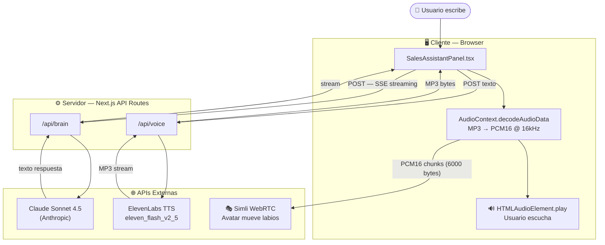
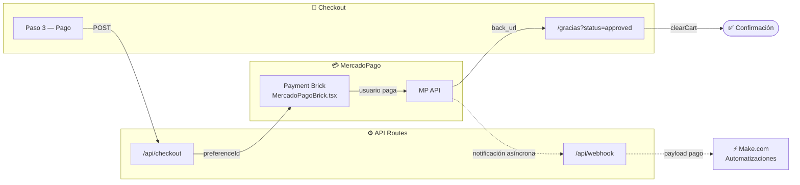

# Platzi Store — Tienda Oficial con Asistente de Ventas por IA

Tienda oficial de Platzi construida con Next.js 15+, con un asistente de ventas conversacional integrado que combina **avatar WebRTC en tiempo real**, **síntesis de voz** e **inteligencia artificial**.

---

## Demo

🔗 **[https://v0-platzi-store-ui.vercel.app](https://v0-platzi-store-ui.vercel.app)**

Abre la tienda y haz clic en el botón **VB** en la esquina inferior derecha para interactuar con **VEGA-BOT**, el asistente de ventas.

---

## Stack Tecnológico

### Tienda
| Capa | Tecnología |
|------|-----------|
| Framework | Next.js 15 (App Router) |
| UI | React 19 + Tailwind CSS v4 |
| Componentes | shadcn/ui |
| Estado carrito | Zustand |
| Pasarela de pagos | MercadoPago Checkout Bricks |
| Tipografías | Inter + Space Grotesk (Google Fonts) |
| Analytics | Vercel Analytics |

### Asistente de Ventas (VEGA-BOT)
| Capa | Tecnología |
|------|-----------|
| IA / Cerebro | Claude Sonnet 4.5 (Anthropic) |
| Síntesis de voz | ElevenLabs TTS (`eleven_flash_v2_5`) |
| Avatar WebRTC | Simli (`simli-client` v3) |
| Audio pipeline | Web Audio API → PCM16 16kHz → Simli |

---

## Características

### Tienda
- Catálogo de productos con filtro por categoría
- Página de detalle por producto (colores, tallas, descripción)
- Carrito lateral con Zustand (persistente en sesión)
- **Checkout en 4 pasos**: datos personales → dirección → pago → confirmación
- **Pasarela MercadoPago**: Checkout Bricks con tarjeta crédito/débito, PSE, efectivo, wallet MP
- **Webhook de notificación**: Recibe y registra eventos de pago de MercadoPago
- Formulario de contacto
- Hero animado, sección de manifiesto, prueba social, newsletter
- Totalmente responsivo

### Asistente VEGA-BOT
- **Avatar animado en tiempo real**: Simli WebRTC sincroniza los labios del avatar con el audio (<300ms de latencia)
- **Conversación en lenguaje natural**: Claude Sonnet 4.5 responde preguntas sobre productos, precios, tallas y colores
- **Voz sintetizada**: ElevenLabs convierte la respuesta a audio MP3 que se reproduce en el navegador
- **Conocimiento dinámico del catálogo**: El system prompt se construye automáticamente desde `lib/products.ts` — al agregar un producto, VEGA-BOT lo conoce al instante
- **Interfaz flotante**: Panel de 370px que aparece sobre cualquier página sin interrumpir la experiencia de compra
- **Sin markdown en respuestas**: Las respuestas son texto plano, limpias para voz y para chat

---

## Arquitectura del Asistente



---

## Estructura del Proyecto

```
v0-platzi-store-ui/
├── app/
│   ├── api/
│   │   ├── brain/route.ts          # Claude Sonnet — streaming SSE
│   │   ├── voice/route.ts          # ElevenLabs TTS — stream MP3
│   │   ├── checkout/route.ts       # MercadoPago — crea preferencia de pago
│   │   └── webhook/route.ts        # MercadoPago — recibe notificaciones de pago
│   ├── checkout/page.tsx           # Página checkout (4 pasos)
│   ├── gracias/page.tsx            # Confirmación de pedido (approved / pending)
│   ├── layout.tsx                  # Root layout + SalesAssistantBubble
│   ├── page.tsx                    # Home: Hero + Catálogo + Secciones
│   └── globals.css
├── components/
│   ├── home/
│   │   ├── hero-section.tsx
│   │   ├── featured-products.tsx
│   │   ├── manifesto-section.tsx
│   │   ├── categories-section.tsx
│   │   ├── social-proof-section.tsx
│   │   └── newsletter-section.tsx
│   ├── checkout/
│   │   ├── checkout-flow.tsx        # Orquestador de los 4 pasos
│   │   ├── step-personal-data.tsx
│   │   ├── step-shipping.tsx
│   │   ├── step-payment.tsx         # Integra MercadoPagoBrick
│   │   └── step-confirmation.tsx
│   ├── sales-assistant/
│   │   ├── AgentAvatar.tsx          # Simli WebRTC (160×160px)
│   │   ├── SalesAssistantPanel.tsx  # Chat + orquestación audio
│   │   └── SalesAssistantBubble.tsx # Botón flotante + panel
│   ├── MercadoPagoBrick.tsx         # Wrapper Payment Brick de MP
│   ├── cart-drawer.tsx
│   ├── navbar.tsx
│   ├── footer.tsx
│   └── ui/                          # shadcn/ui components
├── lib/
│   ├── products.ts                  # Catálogo de 10 productos (fuente de verdad)
│   └── store.ts                     # Zustand store del carrito
└── .env.local                       # Variables de entorno (no se sube al repo)
```

---

## Variables de Entorno

Crea un archivo `.env.local` en la raíz del proyecto:

```env
# Claude API (Anthropic)
ANTHROPIC_API_KEY=sk-ant-...

# ElevenLabs TTS
ELEVENLABS_API_KEY=sk_...
ELEVENLABS_VOICE_ID=<id-de-voz>

# Simli (WebRTC Avatar)
NEXT_PUBLIC_SIMLI_API_KEY=<api-key-simli>
NEXT_PUBLIC_SIMLI_FACE_ID=<face-id-simli>

# MercadoPago
MP_ACCESS_TOKEN=<access-token-mp>
NEXT_PUBLIC_MP_PUBLIC_KEY=<public-key-mp>
NEXT_PUBLIC_URL=https://tu-dominio.com
```

### Cómo obtener cada key

| Variable | Dónde obtenerla |
|----------|----------------|
| `ANTHROPIC_API_KEY` | [console.anthropic.com](https://console.anthropic.com) |
| `ELEVENLABS_API_KEY` | [elevenlabs.io](https://elevenlabs.io) → Profile → API Keys |
| `ELEVENLABS_VOICE_ID` | ElevenLabs → Voice Library → ID de la voz elegida |
| `NEXT_PUBLIC_SIMLI_API_KEY` | [simli.com](https://simli.com) → Dashboard → API Keys |
| `NEXT_PUBLIC_SIMLI_FACE_ID` | Simli → Avatars → selecciona o crea uno → Face ID |
| `MP_ACCESS_TOKEN` | [mercadopago.com/developers](https://www.mercadopago.com/developers) → Credenciales → Access Token |
| `NEXT_PUBLIC_MP_PUBLIC_KEY` | MercadoPago Developers → Credenciales → Public Key |
| `NEXT_PUBLIC_URL` | URL de tu sitio en producción (e.g. `https://v0-platzi-store-ui.vercel.app`) |
| `MAKE_WEBHOOK_URL` | [make.com](https://make.com) → tu escenario → webhook URL (opcional — solo si usas automatizaciones post-pago) |
| `RESEND_API_KEY` | [resend.com](https://resend.com) → API Keys (opcional — solo si usas el formulario de contacto) |
| `CONTACT_EMAIL` | Email donde llegan los mensajes del formulario de contacto |

> ⚠️ **Nota sobre `NEXT_PUBLIC_SIMLI_API_KEY`**: por diseño de WebRTC, esta key es visible en el bundle del navegador. Para protegerla, configura el **domain allowlist** en el dashboard de Simli ([simli.com](https://simli.com) → Settings → Allowed Domains) para que solo funcione desde tu dominio.

> **Sin las keys de VEGA-BOT**: la tienda funciona normalmente. El asistente mostrará "conectando..." pero no hará crash.  
> **Sin las keys de MercadoPago**: el checkout llega hasta el paso 3 y muestra error al intentar crear la preferencia de pago.

---

## Instalación y Desarrollo

```bash
# Clonar el repositorio
git clone https://github.com/DZambranoVF/v0-platzi-store-ui.git
cd v0-platzi-store-ui

# Instalar dependencias
pnpm install

# Configurar variables de entorno
# Crea .env.local con las keys indicadas arriba

# Iniciar servidor de desarrollo
pnpm dev
```

Abre [http://localhost:3000](http://localhost:3000) en tu navegador.

---

## Agregar Productos al Catálogo

Edita `lib/products.ts` — VEGA-BOT aprenderá los nuevos productos automáticamente:

```ts
{
  id: 11,
  name: 'Nuevo Producto',
  price: 89900,          // en pesos colombianos (COP)
  description: 'Descripción del producto',
  category: 'tech',
  colors: ['negro', 'blanco'],
  sizes: ['S', 'M', 'L'],
}
```

---

## Personalizar VEGA-BOT

| Qué cambiar | Dónde |
|-------------|-------|
| Nombre del asistente | `SalesAssistantPanel.tsx` → `buildSystemPrompt()` |
| Personalidad / instrucciones | `SalesAssistantPanel.tsx` → `buildSystemPrompt()` |
| Tamaño del avatar | prop `size` de `AgentAvatar` en `SalesAssistantPanel.tsx` |
| Colores del panel | constante `G` en `SalesAssistantBubble.tsx` y `SalesAssistantPanel.tsx` |
| Modelo de IA | `app/api/brain/route.ts` → campo `model` |
| Voz | `ELEVENLABS_VOICE_ID` en `.env.local` |
| Avatar (cara) | `NEXT_PUBLIC_SIMLI_FACE_ID` en `.env.local` |

---

## Build para Producción

```bash
pnpm build
pnpm start
```

O despliega directamente en **Vercel** — agrega las variables de entorno en el dashboard antes del deploy.

---

## Flujo de Pago (MercadoPago)



- En **sandbox**: usa las tarjetas de prueba de [MercadoPago Colombia](https://www.mercadopago.com.co/developers/es/docs/checkout-bricks/additional-content/your-integrations/test/cards)
- En **producción**: reemplaza las keys `TEST-` por las credenciales productivas de tu cuenta MP
- El webhook siempre responde `200` para evitar reintentos de MP; los logs se registran en consola (Cloud Run / Vercel logs)

---

## Notas Técnicas

- `reactStrictMode: false` en `next.config.mjs` — requerido para Simli (evita sesiones WebRTC duplicadas en desarrollo)
- Los callbacks `onReady` y `onError` del avatar van envueltos en `useCallback(fn, [])` — evita reconexiones de Simli al re-renderizar el componente
- `.env*` está en `.gitignore` — las API keys nunca se suben al repositorio
- El audio pipeline convierte MP3 → PCM16 @ 16kHz en el cliente con `AudioContext.decodeAudioData` para sincronizar los labios del avatar

---

## Licencia

MIT — construido para la comunidad Platzi.
